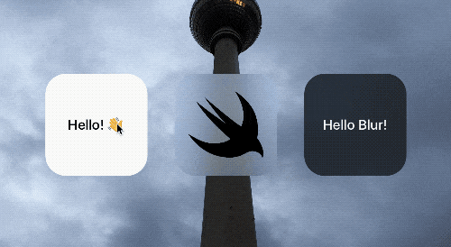

<p align="center"></p>

<p align="center">
    <a href="https://travis-ci.org/BalestraPatrick/SquishButton">
        
    </a>
    <a href="https://github.com/Carthage/Carthage">
        
    </a>
    <a href="http://cocoapods.org/pods/HapticButton">
        
    </a>
    <a href="http://cocoapods.org/pods/SquishButton">
        
    </a>
    <a href="https://twitter.com/BalestraPatrick">
        
    </a>
</p>

# HapticButton

## 📖 Description

`HapticButton` replicates the behavior of some buttons in the iOS 10 and 11 Control Center as well as in the Home app. A device with 3D Touch is required to fully experience it. 

The user is required to press the button and activate 3D Touch with a minimum threshold (you can specify the minimum value to trigger the button via the `feedbackThreshold` property). This allows for a cool interaction that gives an haptic feedback to the user when the button is triggered. 👍

For the best experience, install the example on a device. 📱

The example project shows how to set up `HapticButton` in a few different ways.

- Create a button with a `UILabel`. Use the `HapticButtonDelegate` to be notified when the button is triggered.

```swift
@IBOutlet weak var button: HapticButton!
button.mode = .label(text: "Hello! 👋")
// Use the delegate method to be notified when the button is pressed.
button.delegate = self
```

- Create a button with a `UIImageView` and a blur background. Use the standard `UIControl` event to subscribe to the touch up inside event.

```swift
let blurButton = HapticButton(mode: .image(image: #imageLiteral(resourceName: "swift")))
blurButton.addBlurView(style: .light)
// Add custom target selector to the touch up inside event.
blurButton.addTarget(self, action: #selector(blurButtonPressed(_:)), for: .touchUpInside)
```

- Create a button with a customized `UILabel` and dark blur background. Subcribe to the button events through a closure.

```swift
let blurButton = HapticButton(mode: .label(text: "Hello Blur!"))
darkBlurButton.textLabel.textColor = .white
darkBlurButton.addBlurView(style: .dark)
// Pass closure to be invoked when the button is pressed.
darkBlurButton.onPressed = {
	print("Dark blur button pressed.")
}
```

## 🎨 Customizations
These are the public properties that allows you to customize the control. In case you are thinking to modify `HapticButton` even further, consider creating a [Pull Request](https://github.com/BalestraPatrick/HapticButton/compare)! 👏🏻

```swift
public weak var delegate: HapticButtonDelegate?

/// The closure invoked when the button is pressed.
public var onPressed: Callback?

/// The minium pressure that the button press has to receive in order to trigger the related haptic feedback. The value has to be between 0 and 1 and the default is 0.25.
public var feedbackThreshold = 0.25

/// If the button is in mode `label`, this `UILabel` is part of the button hierarchy. Modify this object directly for more customizations on the displayed text.
public lazy var textLabel: UILabel

/// If the button is in mode `image`, this `UIImageView` is part of the button hierarchy. Modify this object directly for more customizations on the displayed image.
public lazy var imageView: UIImageView

/// The current mode of the button.
public var mode = HapticButtonMode.label(text: "Title")
```

## 🔞 Requirements
iOS 10.0 and Swift 3.2 are required. 

If you are using Swift 4, please use the [swift4 branch](https://github.com/BalestraPatrick/ParticlesLoadingView/tree/swift4).

## 🛠 Installation

`HapticButton` is available through [CocoaPods](http://cocoapods.org). To install
it, simply add the following line to your `Podfile`:

```ruby
pod "HapticButton"
```

You can also use [Carthage](https://github.com/Carthage/Carthage) if you prefer. Add this line to your `Cartfile`.

```ruby
github "BalestraPatrick/HapticButton"
```

## 👨‍💻 Author

I'm [Patrick Balestra](http://www.patrickbalestra.com).

Email: [me@patrickbalestra.com](mailto:me@patrickbalestra.com)

Twitter: [@BalestraPatrick](http://twitter.com/BalestraPatrick).

## License

`HapticButton` is available under the MIT license. See the [LICENSE](LICENSE) file for more info.